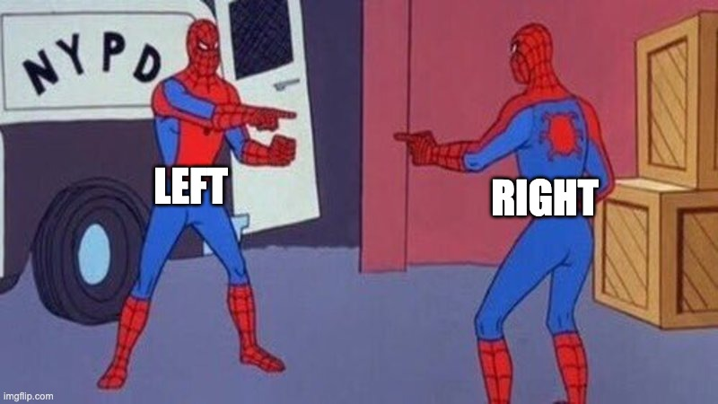

# Two-Pointers :hand:
<span style = "color: grey">by:</span>Bradley Allen

---
### What is Two-pointers?



---
# 🧠 Two Pointer Technique  
## Efficient Pattern for Array Problems  
### in C++

---

## 🎯 Goal of This Lesson

- Understand what the two pointer technique is
- Learn when and **why** to use it
- Walk through a real problem with visuals
- Code the brute force + optimized solution in C++
- Compare time complexity
- See where it appears on LeetCode/interviews

---

## 🧩 Problem Example

**❓ Problem:**  
Given an array of integers and a target sum,  
determine if any **two numbers** add up to the target.

```cpp
vector<int> nums = {1, 3, 4, 6, 10};
int target = 7;
```
✅ Return true because 3 + 4 = 7.

---

# 🚫 Brute Force Approach
Use two nested for loops
Compare all pairs

---
```cpp
bool hasPairWithSum(vector<int>& nums, int target)
 {
    for (int i = 0; i < nums.size(); ++i) 
    {
        for (int j = i + 1; j < nums.size(); ++j) 
        {
            if (nums[i] + nums[j] == target)
             return true;
        }
    }
    return false;
}

```
---